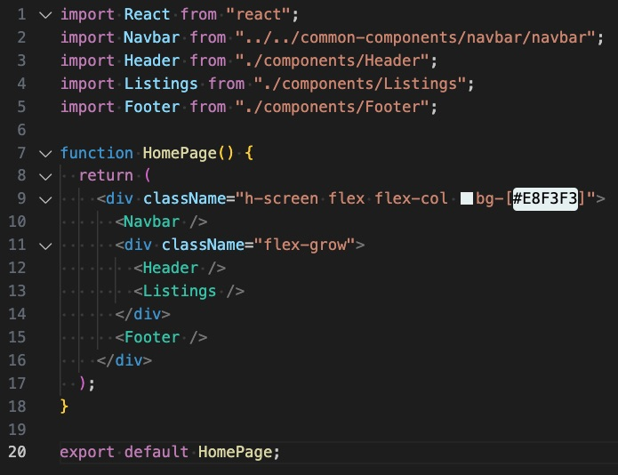

# The Bob Ross Gallery website documentation

Table of Contents

- Project
  - [Overview](#1-project)

- Pages
  - [HomePage](#2-pages)

- Libraries
    - [React](#react)
    - [Font Awesome](#font-awesome)

- Framworks
    - [Tailwind-css](#tailwind-css)

- Getting started
    - [Instructions](#5-getting-started-with-the-bob-ross-gallery-website)

## 1. Project
#### *Overview*:

    "The Bob Ross Gallery website is an online platform dedicated to celebrating the life and artistic legacy of the iconic American painter, Bob Ross. This website serves as a digital gallery where visitors can immerse themselves in the beauty of Bob Ross's timeless landscapes and learn about his unique 'wet-on-wet' oil painting technique. Explore a vast collection of his tranquil and inspiring artworks, discover the man behind the 'Joy of Painting' television series, and find resources to further your own creative journey. Whether you're an art enthusiast, a Bob Ross fan, or someone seeking a peaceful escape into the world of art, The Bob Ross Gallery website offers a serene and informative experience."

## 2. Pages
#### *Home Page*:

##### *Description:*

The HomePage component serves as the home page for 'The Bob Ross Gallery' website, providing users with a welcoming and visually appealing introduction to the site. This React function component integrates various essential elements of the website, including the navigation bar, a captivating header section, listings of Bob Ross's artworks, and a footer.

##### *Components Used:*

###### *Navbar:* 

- The navigation bar offers users easy access to various sections of the website, enhancing navigation and user experience.

###### *Header:* 

- The header section introduces the website's theme and sets the tone for visitors, inviting them to explore the world of Bob Ross's art.

###### *Listings:*

 - This section showcases Bob Ross's artworks, allowing users to browse and enjoy his creations.

 ###### *Footer:*

- The footer provides important information and links, ensuring a comprehensive user experience.

###### *Layout and Styling:*

- The component utilizes CSS classes to control the layout and styling, including background color.

###### *Usage:*

- The HomePage component is integrated into the website's routing system to serve as the main entry point for visitors.

###### *Key Features:*

- Efficiently combines essential website sections for a cohesive and engaging user experience.

- Implements a responsive and visually pleasing layout.

- Incorporates other React components for modularity and maintainability.

###### *Example Usage:*

## 3. Libraries
### *React*:

### Available Scripts

In the project directory, you can run:

### `npm start`

Runs the app in the development mode.\
Open [http://localhost:3000](http://localhost:3000) to view it in your browser.

The page will reload when you make changes.\
You may also see any lint errors in the console.

### `npm test`

Launches the test runner in the interactive watch mode.\
See the section about [running tests](https://facebook.github.io/create-react-app/docs/running-tests) for more information.

### `npm run build`

Builds the app for production to the `build` folder.\
It correctly bundles React in production mode and optimizes the build for the best performance.

The build is minified and the filenames include the hashes.\
Your app is ready to be deployed!

See the section about [deployment](https://facebook.github.io/create-react-app/docs/deployment) for more information.

### `npm run eject`

**Note: this is a one-way operation. Once you `eject`, you can't go back!**

If you aren't satisfied with the build tool and configuration choices, you can `eject` at any time. This command will remove the single build dependency from your project.

Instead, it will copy all the configuration files and the transitive dependencies (webpack, Babel, ESLint, etc) right into your project so you have full control over them. All of the commands except `eject` will still work, but they will point to the copied scripts so you can tweak them. At this point you're on your own.

You don't have to ever use `eject`. The curated feature set is suitable for small and middle deployments, and you shouldn't feel obligated to use this feature. However we understand that this tool wouldn't be useful if you couldn't customize it when you are ready for it.

## Learn More

You can learn more in the [Create React App documentation](https://facebook.github.io/create-react-app/docs/getting-started).

To learn React, check out the [React documentation](https://reactjs.org/).

### Code Splitting

This section has moved here: [https://facebook.github.io/create-react-app/docs/code-splitting](https://facebook.github.io/create-react-app/docs/code-splitting)

### Analyzing the Bundle Size

This section has moved here: [https://facebook.github.io/create-react-app/docs/analyzing-the-bundle-size](https://facebook.github.io/create-react-app/docs/analyzing-the-bundle-size)

### Making a Progressive Web App

This section has moved here: [https://facebook.github.io/create-react-app/docs/making-a-progressive-web-app](https://facebook.github.io/create-react-app/docs/making-a-progressive-web-app)

### Advanced Configuration

This section has moved here: [https://facebook.github.io/create-react-app/docs/advanced-configuration](https://facebook.github.io/create-react-app/docs/advanced-configuration)

### Deployment

This section has moved here: [https://facebook.github.io/create-react-app/docs/deployment](https://facebook.github.io/create-react-app/docs/deployment)

### `npm run build` fails to minify

This section has moved here: [https://facebook.github.io/create-react-app/docs/troubleshooting#npm-run-build-fails-to-minify](https://facebook.github.io/create-react-app/docs/troubleshooting#npm-run-build-fails-to-minify)

### *Font Awesome*

The incorporation of the Font Awesome library into 'The Bob Ross Gallery website' is a valuable enhancement that adds a touch of creativity and functionality to our project. Font Awesome offers an extensive selection of scalable icons and symbols that perfectly complement the artistic and user-friendly nature of our website. These icons not only enhance the visual appeal but also serve as intuitive navigation aids, making it easier for visitors to explore Bob Ross's beautiful artworks and resources. From paintbrush icons to social media links, Font Awesome simplifies the process of creating an aesthetically pleasing and informative online art gallery. Its versatility ensures that our website is both engaging and user-centric, contributing to a delightful browsing experience for art enthusiasts and fans of Bob Ross.  

Visit Font Awesome for [documentation](https://fontawesome.com/).

## 4. Frameworks
#### *Tailwind-CSS*

The integration of the Tailwind CSS library within 'The Bob Ross Gallery website' is an invaluable asset to our project. Tailwind CSS offers a highly efficient and customizable way to design and style our website, enabling us to maintain a clean and responsive user interface. Its utility-first approach streamlines the development process, allowing for the rapid creation and management of UI components and layouts. Tailwind CSS not only ensures a visually pleasing design but also enhances the user experience by optimizing performance and responsiveness. With its extensive collection of pre-built styles and utility classes, Tailwind CSS empowers our project to deliver an elegant, efficient, and enjoyable online gallery for art enthusiasts and Bob Ross fans alike.  

Visit Tailwind-CSS [documentation](https://tailwindcss.com/docs/installation).

## 5. Getting started with the Bob Ross Gallery Website
#### *Step 1*:
#### *Step 2*:
#### *Step 3*:

